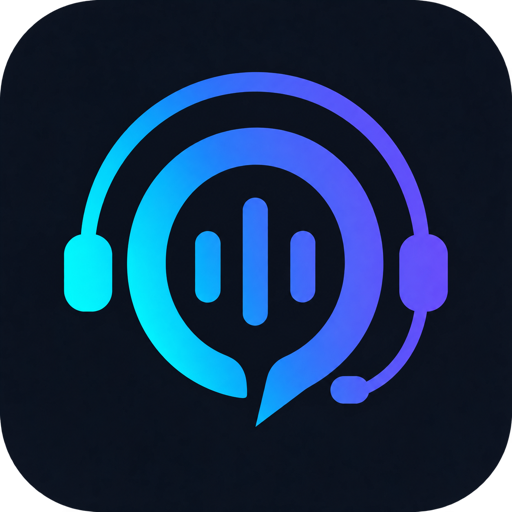
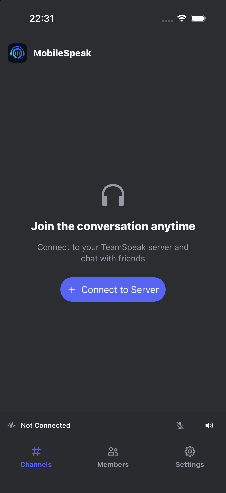
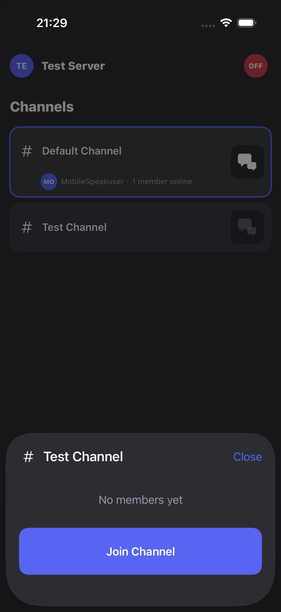
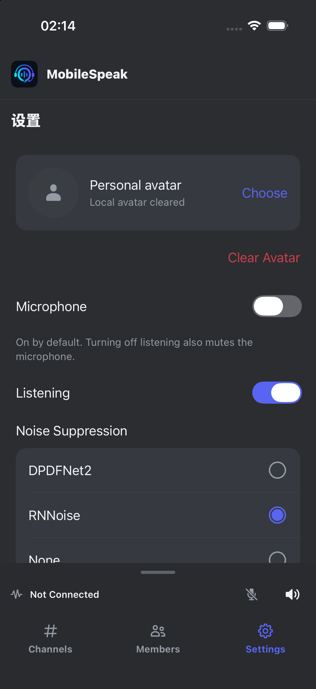

  
  <h1>MobileSpeak</h1>

<h2 align="center">界面预览</h2>

  
  
  

<h2 align="center">目前已实现的功能</h2>

<table align="center">
  <thead>
    <tr>
      <th style="vertical-align: middle; text-align: center;">功能</th>
      <th style="vertical-align: middle; text-align: center;">TeamSpeak</th>
      <th style="vertical-align: middle; text-align: center;">MobileSpeak</th>
    </tr>
  </thead>
  <tbody>
    <tr><td style="vertical-align: middle; text-align: center;">直接连接服务器</td><td style="vertical-align: middle; text-align: center;">✅</td><td style="vertical-align: middle; text-align: center;">✅</td></tr>
    <tr><td style="vertical-align: middle; text-align: center;">服务器书签</td><td style="vertical-align: middle; text-align: center;">✅</td><td style="vertical-align: middle; text-align: center;">✅</td></tr>
    <tr><td style="vertical-align: middle; text-align: center;">服务器密码保存</td><td style="vertical-align: middle; text-align: center;">✅</td><td style="vertical-align: middle; text-align: center;">✅</td></tr>
    <tr><td style="vertical-align: middle; text-align: center;">身份认证与身份持久化</td><td style="vertical-align: middle; text-align: center;">✅</td><td style="vertical-align: middle; text-align: center;">✅</td></tr>
    <tr><td style="vertical-align: middle; text-align: center;">断线自动重连</td><td style="vertical-align: middle; text-align: center;">✅</td><td style="vertical-align: middle; text-align: center;">✅</td></tr>
    <tr><td style="vertical-align: middle; text-align: center;">公共社区发现、搜索与加入（仅 TeamSpeak 6）</td><td style="vertical-align: middle; text-align: center;">✅</td><td style="vertical-align: middle; text-align: center;">❌</td></tr>
    <tr><td style="vertical-align: middle; text-align: center;">频道与子频道浏览</td><td style="vertical-align: middle; text-align: center;">✅</td><td style="vertical-align: middle; text-align: center;">✅</td></tr>
    <tr><td style="vertical-align: middle; text-align: center;">加入频道</td><td style="vertical-align: middle; text-align: center;">✅</td><td style="vertical-align: middle; text-align: center;">✅</td></tr>
    <tr><td style="vertical-align: middle; text-align: center;">加入密码频道</td><td style="vertical-align: middle; text-align: center;">✅</td><td style="vertical-align: middle; text-align: center;">✅</td></tr>
    <tr><td style="vertical-align: middle; text-align: center;">语音通信</td><td style="vertical-align: middle; text-align: center;">✅</td><td style="vertical-align: middle; text-align: center;">✅</td></tr>
    <tr><td style="vertical-align: middle; text-align: center;">协议加密与安全身份</td><td style="vertical-align: middle; text-align: center;">✅</td><td style="vertical-align: middle; text-align: center;">✅</td></tr>
    <tr><td style="vertical-align: middle; text-align: center;">音频编解码器选择</td><td style="vertical-align: middle; text-align: center;">✅</td><td style="vertical-align: middle; text-align: center;">❌</td></tr>
    <tr><td style="vertical-align: middle; text-align: center;">自动麦克风音量调整</td><td style="vertical-align: middle; text-align: center;">✅</td><td style="vertical-align: middle; text-align: center;">❌</td></tr>
    <tr><td style="vertical-align: middle; text-align: center;">背景噪声抑制</td><td style="vertical-align: middle; text-align: center;">✅</td><td style="vertical-align: middle; text-align: center;">✅</td></tr>
    <tr><td style="vertical-align: middle; text-align: center;">回声消除</td><td style="vertical-align: middle; text-align: center;">✅</td><td style="vertical-align: middle; text-align: center;">✅</td></tr>
    <tr><td style="vertical-align: middle; text-align: center;">麦克风静音</td><td style="vertical-align: middle; text-align: center;">✅</td><td style="vertical-align: middle; text-align: center;">✅</td></tr>
    <tr><td style="vertical-align: middle; text-align: center;">关闭收听</td><td style="vertical-align: middle; text-align: center;">✅</td><td style="vertical-align: middle; text-align: center;">✅</td></tr>
    <tr><td style="vertical-align: middle; text-align: center;">位置音频（仅 TeamSpeak 3）</td><td style="vertical-align: middle; text-align: center;">✅</td><td style="vertical-align: middle; text-align: center;">❌</td></tr>
    <tr><td style="vertical-align: middle; text-align: center;">频道文字聊天</td><td style="vertical-align: middle; text-align: center;">✅</td><td style="vertical-align: middle; text-align: center;">✅</td></tr>
    <tr><td style="vertical-align: middle; text-align: center;">一对一私聊</td><td style="vertical-align: middle; text-align: center;">✅</td><td style="vertical-align: middle; text-align: center;">✅</td></tr>
    <tr><td style="vertical-align: middle; text-align: center;">群组聊天（仅 TeamSpeak 6）</td><td style="vertical-align: middle; text-align: center;">✅</td><td style="vertical-align: middle; text-align: center;">❌</td></tr>
    <tr><td style="vertical-align: middle; text-align: center;">联系人管理与搜索（仅 TeamSpeak 6）</td><td style="vertical-align: middle; text-align: center;">✅</td><td style="vertical-align: middle; text-align: center;">❌</td></tr>
    <tr><td style="vertical-align: middle; text-align: center;">消息未读提醒</td><td style="vertical-align: middle; text-align: center;">✅</td><td style="vertical-align: middle; text-align: center;">✅</td></tr>
    <tr><td style="vertical-align: middle; text-align: center;">聊天记录</td><td style="vertical-align: middle; text-align: center;">✅</td><td style="vertical-align: middle; text-align: center;">✅</td></tr>
    <tr><td style="vertical-align: middle; text-align: center;">头像、徽章与服务器/频道组图标</td><td style="vertical-align: middle; text-align: center;">✅</td><td style="vertical-align: middle; text-align: center;">✅</td></tr>
    <tr><td style="vertical-align: middle; text-align: center;">修改个人头像</td><td style="vertical-align: middle; text-align: center;">✅</td><td style="vertical-align: middle; text-align: center;">✅</td></tr>
    <tr><td style="vertical-align: middle; text-align: center;">文件、图片与链接分享（仅 TeamSpeak 6）</td><td style="vertical-align: middle; text-align: center;">✅</td><td style="vertical-align: middle; text-align: center;">❌</td></tr>
    <tr><td style="vertical-align: middle; text-align: center;">文件传输</td><td style="vertical-align: middle; text-align: center;">✅</td><td style="vertical-align: middle; text-align: center;">❌</td></tr>
    <tr><td style="vertical-align: middle; text-align: center;">频道与子频道创建/管理</td><td style="vertical-align: middle; text-align: center;">✅</td><td style="vertical-align: middle; text-align: center;">❌</td></tr>
    <tr><td style="vertical-align: middle; text-align: center;">层级权限系统</td><td style="vertical-align: middle; text-align: center;">✅</td><td style="vertical-align: middle; text-align: center;">❌</td></tr>
    <tr><td style="vertical-align: middle; text-align: center;">服务器组与频道组管理</td><td style="vertical-align: middle; text-align: center;">✅</td><td style="vertical-align: middle; text-align: center;">❌</td></tr>
    <tr><td style="vertical-align: middle; text-align: center;">踢出与封禁管理</td><td style="vertical-align: middle; text-align: center;">✅</td><td style="vertical-align: middle; text-align: center;">❌</td></tr>
    <tr><td style="vertical-align: middle; text-align: center;">屏幕共享（仅 TeamSpeak 6）</td><td style="vertical-align: middle; text-align: center;">✅</td><td style="vertical-align: middle; text-align: center;">❌</td></tr>
    <tr><td style="vertical-align: middle; text-align: center;">摄像头与实时视频（仅 TeamSpeak 6）</td><td style="vertical-align: middle; text-align: center;">✅</td><td style="vertical-align: middle; text-align: center;">❌</td></tr>
    <tr><td style="vertical-align: middle; text-align: center;">通过 Communities 创建与托管社区服务器（仅 TeamSpeak 6）</td><td style="vertical-align: middle; text-align: center;">✅</td><td style="vertical-align: middle; text-align: center;">❌</td></tr>
    <tr><td style="vertical-align: middle; text-align: center;">游戏内覆盖层</td><td style="vertical-align: middle; text-align: center;">✅</td><td style="vertical-align: middle; text-align: center;">❌</td></tr>
    <tr><td style="vertical-align: middle; text-align: center;">插件、扩展、主题与字体定制</td><td style="vertical-align: middle; text-align: center;">✅</td><td style="vertical-align: middle; text-align: center;">❌</td></tr>
    <tr><td style="vertical-align: middle; text-align: center;">myTeamSpeak 账户与跨设备同步</td><td style="vertical-align: middle; text-align: center;">✅</td><td style="vertical-align: middle; text-align: center;">❌</td></tr>
  </tbody>
</table>

<h2 align="center">许可证</h2>

MobileSpeak 的原创内容采用 [MIT 许可证](LICENSE)。第三方代码、模型及资源遵循各自的许可证，详见 [第三方声明](THIRD_PARTY_NOTICES.md) 和 [licenses](licenses/) 目录。
